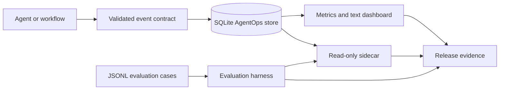

# AgentOps Observability Lab

A local-first observability, evaluation and read-only inspection system for AI-agent workflows.

The repository consolidates four previously separate Hermes components into one installable and testable system:

1. **AgentOps event store** — SQLite sessions, LLM calls, tools, retries, errors and quality scores.
2. **Metrics and text dashboard** — aggregate and session-level operational views.
3. **Evaluation harness** — deterministic JSONL cases with tool, citation, latency and task-success metrics.
4. **Read-only sidecar** — tool-shaped handlers that inspect evidence without mutating the database.

The lab is compatible with systems such as [MEL Governor](https://github.com/net421/mel-governor), the Semantic Layer Agent and the Supply Chain Decision Twin through a small event contract. It does not require those repositories and does not claim that they are deployed as one production platform.

## Architecture



## Event model

| Table | Purpose |
|---|---|
| `sessions` | Provider, model, lifecycle status and timestamps |
| `llm_calls` | Prompt/completion tokens and latency |
| `tool_calls` | Tool name, latency and success |
| `retries` | Operation, count and reason |
| `errors` | Error type, message and fatality |
| `quality_scores` | Bounded dimension scores plus JSON metadata |

## Quick start

```bash
python -m pip install -e ".[dev]"
agentops-lab seed-demo --db /tmp/agentops.db
agentops-lab dashboard --db /tmp/agentops.db
agentops-lab session --db /tmp/agentops.db --session-id session_001
agentops-lab eval --cases cases/agentops_smoke.jsonl
agentops-lab list-tools
```

Example Python instrumentation:

```python
from agentops_observability import AgentOpsStore, SessionEvent, LLMCallEvent

with AgentOpsStore("trace.db") as store:
    store.insert_session(SessionEvent(session_id="run-001", provider="mock", model="research-agent"))
    store.insert_llm_call(
        LLMCallEvent(
            session_id="run-001",
            provider="mock",
            model="research-agent",
            prompt_tokens=120,
            completion_tokens=80,
            total_tokens=200,
            latency_ms=450,
        )
    )
```

## Read-only guarantees

The sidecar:

- opens SQLite with `mode=ro`;
- enables `PRAGMA query_only=ON`;
- exposes only three allow-listed tools;
- rejects missing files, directories and unknown tools;
- never accepts arbitrary SQL;
- verifies in tests that database bytes do not change.

See [docs/SECURITY.md](docs/SECURITY.md).

## Validation

```bash
make verify
```

The release gate runs the full test suite, creates a deterministic demonstration database in a temporary directory, evaluates ten domain-specific cases, checks the read-only invariant, scans the public tree for secrets/runtime state and writes machine-readable evidence.

## Claim boundaries

- The repository demonstrates local/laboratory AgentOps patterns.
- Sample data and evaluation outputs are synthetic.
- The text dashboard is not a hosted monitoring service.
- The sidecar is a tool adapter, not a network MCP server.
- Quality scores measure configured checks; they are not automatic truth or safety guarantees.
- No external agent receives autonomous real-world authority.

## Portfolio relationship

```text
MEL Governor / Semantic Agent / Decision Twin
                    ↓ event contract
        AgentOps Observability Lab
        ├── SQLite traces
        ├── quality metrics
        ├── regression evaluation
        └── read-only inspection tools
```

## License

MIT. See [LICENSE](LICENSE).
